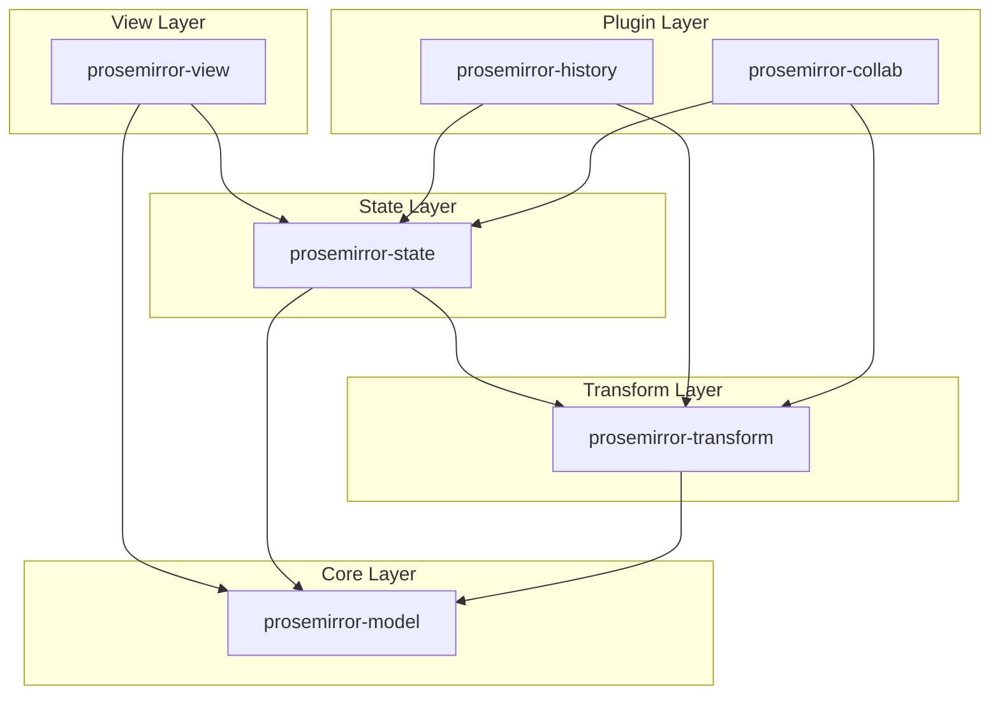
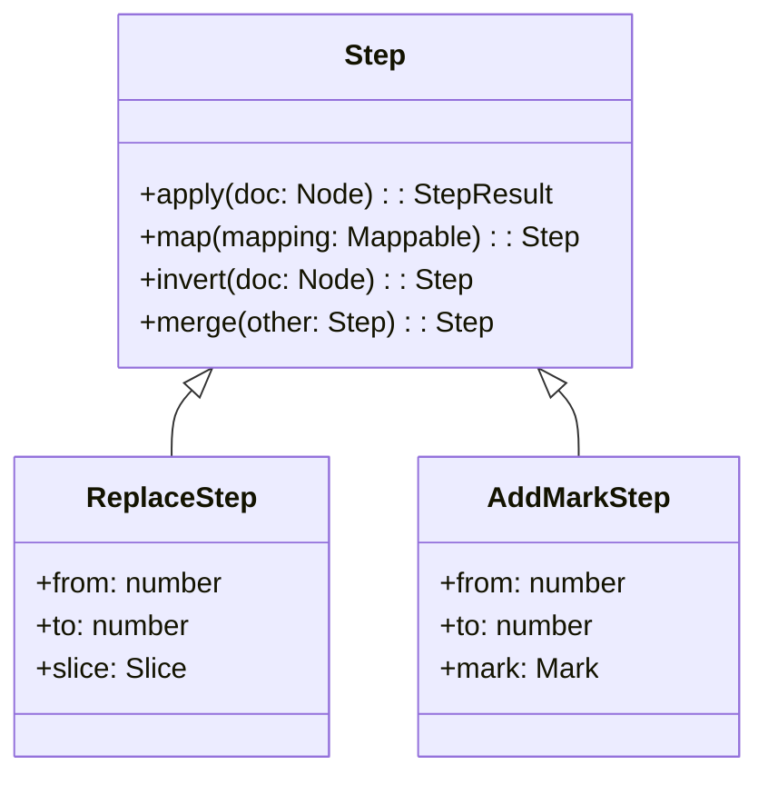
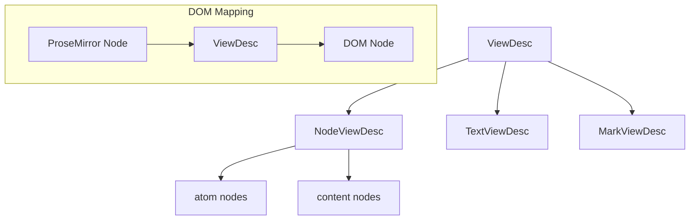
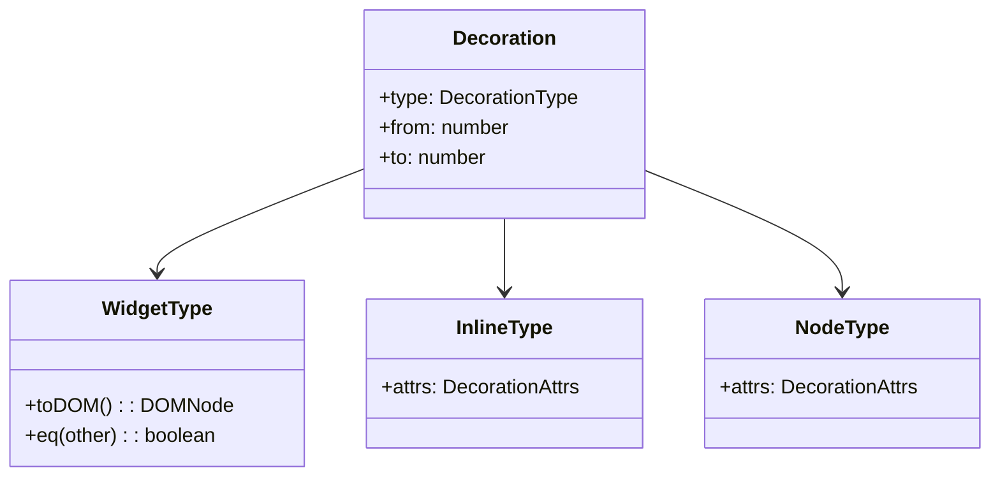
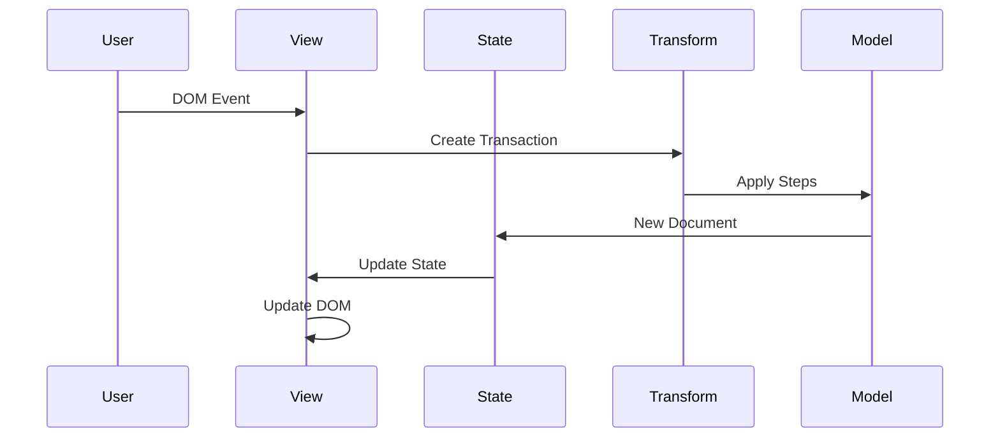

## 整体架构

ProseMirror 采用模块化架构，由 6 个核心模块组成：



## 核心模块详解

### 1. prosemirror-model - 文档模型

#### Node 类实现

`Node` 是文档树的核心数据结构：

```typescript
export class Node {
  readonly type: NodeType
  readonly attrs: Attrs
  readonly content: Fragment
  readonly marks: readonly Mark[]

  // 不可变操作 - 返回新节点
  cut(from: number, to?: number): Node
  copy(content?: Fragment): Node
  mark(marks: readonly Mark[]): Node
}
```

关键特性：

- **不可变性**: 所有操作返回新实例，保证数据一致性
- **树形结构**: 通过 Fragment 管理子节点
- **类型系统**: NodeType 定义节点行为和约束

#### Schema 系统

`Schema` 定义文档结构规则：

```typescript
export class Schema {
  readonly nodes: { [name: string]: NodeType }
  readonly marks: { [name: string]: MarkType }
  readonly cached: { [key: string]: any } = Object.create(null)

  // 内容匹配算法
  contentMatch(node: NodeType): ContentMatch
}
```

### 2. prosemirror-transform - 变换系统

#### Step 抽象

所有文档变更都通过 Step 实现：



#### Transform 类

`Transform` 管理 Step 序列：

```typescript
export class Transform {
  readonly doc: Node
  readonly steps: readonly Step[] = []
  readonly docs: readonly Node[] = []
  readonly mapping = new Mapping()

  // 核心方法
  step(step: Step): this {
    let result = step.apply(this.doc)
    if (result.failed) throw new TransformError(result.failed)
    return this.addStep(step, result.doc!)
  }
}
```

### 3. prosemirror-state - 状态管理

#### EditorState 设计

`EditorState` 采用不可变状态模式：

```typescript
export class EditorState {
  readonly doc: Node
  readonly selection: Selection
  readonly storedMarks: readonly Mark[] | null
  readonly config: Configuration

  // 状态转换
  apply(tr: Transaction): EditorState {
    return this.applyInner(tr)
  }
}
```

#### Transaction 机制

继承自 Transform，添加选择和元数据管理：

```typescript
export class Transaction extends Transform {
  readonly selection: Selection
  readonly meta: { [key: string]: any } = Object.create(null)

  setSelection(selection: Selection): Transaction
  setMeta(key: string, value: any): Transaction
}
```

### 4. prosemirror-view - 视图渲染

#### EditorView 核心

`EditorView` 连接状态和 DOM：

```typescript
export class EditorView {
  readonly state: EditorState
  readonly dom: HTMLElement
  readonly props: DirectEditorProps

  // 状态更新流程
  updateState(state: EditorState) {
    this.updateStateInner(state, this.state)
  }

  private updateStateInner(state: EditorState, prevState: EditorState) {
    this.state = state
    this.updateDoc(prevState.doc, state.doc)
    this.updateSelection(prevState, state)
  }
}
```

#### ViewDesc 系统

用于高效 DOM 更新的虚拟 DOM 实现：



#### DOM 更新算法

```typescript
// prosemirror-view/src/viewdesc.ts
updateChildren(view: EditorView, offset: number) {
  let inline = this.node.inlineContent

  for (let i = 0, off = offset; i < this.children.length; i++) {
    let child = this.children[i], end = off + child.size
    if (child.dirty || !child.matchesNode(view.state.doc.resolve(off))) {
      // 需要更新的子节点
      this.updateChild(view, child, off)
    }
    off = end
  }
}
```

## DOM 解析与序列化

### DOMParser 实现

`DOMParser` 将 HTML 转换为 ProseMirror 文档：

```typescript
export class DOMParser {
  readonly rules: readonly ParseRule[]
  readonly schema: Schema

  parse(dom: DOMNode, options: ParseOptions = {}): Node {
    let context = new ParseContext(this, options, false)
    context.addAll(dom, Mark.none, options.from, options.to)
    return context.finish() as Node
  }

  parseSlice(dom: DOMNode, options: ParseOptions = {}) {
    let context = new ParseContext(this, options, true)
    context.addAll(dom, Mark.none, options.from, options.to)
    return Slice.maxOpen(context.finish() as Fragment)
  }
}
```

### DOMSerializer 实现

`DOMSerializer` 将文档序列化为 DOM：

```typescript
export class DOMSerializer {
  readonly nodes: { [node: string]: (node: Node) => DOMOutputSpec }
  readonly marks: { [mark: string]: (mark: Mark, inline: boolean) => DOMOutputSpec }

  serializeFragment(
    fragment: Fragment,
    options: { document?: Document } = {},
    target?: HTMLElement | DocumentFragment
  ) {
    if (!target) target = doc(options).createDocumentFragment()

    let top = target!,
      active: [Mark, HTMLElement | DocumentFragment][] = []
    fragment.forEach(node => {
      // Mark 堆栈管理
      if (active.length || node.marks.length) {
        this.syncMarks(active, node.marks, top, options)
      }
      top.appendChild(this.serializeNodeInner(node, options))
    })

    return target
  }
}
```

## 装饰系统

### Decoration 类型



### DecorationSet 实现

```typescript
// prosemirror-view/src/decoration.ts
export class DecorationSet {
  private constructor(readonly local: readonly Decoration[], readonly children: DecorationSet[]) {}

  // 高效映射算法
  map(mapping: Mappable, doc: Node): DecorationSet {
    if (this == empty || mapping.maps.length == 0) return this
    return this.mapInner(mapping, doc, 0, 0, mapping.maps.length)
  }

  // 查找装饰
  find(start?: number, end?: number, predicate?: (spec: any) => boolean): Decoration[] {
    let result: Decoration[] = []
    this.findInner(start == null ? 0 : start, end == null ? 1e9 : end, result, 0, predicate)
    return result
  }
}
```

## 插件系统

### Plugin 架构

```typescript
// prosemirror-state/src/plugin.ts
export class Plugin<PluginState = any> {
  readonly spec: PluginSpec<PluginState>
  readonly key: PluginKey<PluginState> | undefined

  constructor(spec: PluginSpec<PluginState>) {
    this.spec = spec
    this.key = spec.key
  }
}

interface PluginSpec<PluginState> {
  state?: StateField<PluginState>
  props?: EditorProps
  view?: (view: EditorView) => PluginView
  appendTransaction?: (
    transactions: readonly Transaction[],
    oldState: EditorState,
    newState: EditorState
  ) => Transaction | null
}
```

### History 插件实现

`history` 展示了复杂插件的实现模式：

```typescript
// 历史分支结构
class Branch {
  constructor(readonly items: BranchItem[], readonly eventCount: number = 0) {}

  // 添加可撤销项
  addTransform(
    transform: Transform,
    selection?: SelectionBookmark,
    histOptions?: any,
    preserveItems?: boolean
  ) {
    // 实现撤销栈逻辑
  }
}

// 插件状态
class HistoryState {
  constructor(
    readonly done: Branch,
    readonly undone: Branch,
    readonly prevRanges: number[] | null = null,
    readonly prevTime: number = 0
  ) {}
}
```

## 协作编辑

### 操作变换算法

`collab` 实现 OT 算法：

```typescript
class Rebaseable {
  constructor(readonly step: Step, readonly inverted: Step, readonly origin: Transform) {}
}

export function receiveTransaction(
  state: EditorState,
  steps: readonly Step[],
  clientIDs: readonly number[]
) {
  let collabState = collabKey.getState(state)!
  let version = collabState.version + steps.length

  // 操作变换核心逻辑
  let rebaseable = collabState.unconfirmed.map(
    rec =>
      new Rebaseable(
        rec.step,
        rec.step.invert(rec.origin.docs[rec.origin.steps.indexOf(rec.step)]),
        rec.origin
      )
  )

  // 变换本地未确认操作
  for (let i = 0; i < steps.length; i++) {
    for (let j = 0; j < rebaseable.length; j++) {
      rebaseable[j] = new Rebaseable(
        rebaseable[j].step.map(steps[i].getMap())!,
        rebaseable[j].inverted,
        rebaseable[j].origin
      )
    }
  }

  return { state: newState, transform: tr }
}
```

## 性能优化策略

### 1. 增量更新

- ViewDesc 系统只更新变化的 DOM 节点
- DecorationSet 使用树形结构减少映射开销

### 2. 内存优化

- Node 共享不变内容
- Schema 缓存计算结果

### 3. 事件处理优化

```typescript
// prosemirror-view/src/input.ts
export class InputState {
  composition: { node: Text; pos: number; start: number; end: number } | null = null

  // 批量处理 DOM 变更
  flushSoon() {
    if (this.flushTimeout < 0) this.flushTimeout = window.setTimeout(() => this.flush(), 20)
  }
}
```

### 4. DOM 观察器

```typescript
// prosemirror-view/src/domobserver.ts
export class DOMObserver {
  constructor(
    readonly view: EditorView,
    readonly handleDOMChange: (from: number, to: number, typeOver: boolean, added: Node[]) => void
  ) {
    this.observer =
      window.MutationObserver &&
      new window.MutationObserver(mutations => {
        for (let i = 0; i < mutations.length; i++) this.queue.push(mutations[i])
        this.flush()
      })
  }
}
```

## 关键数据流



这个架构的核心优势：

1. **数据不可变**: 保证状态一致性和时间旅行
2. **模块解耦**: 每个模块职责单一，可独立使用
3. **扩展性强**: 插件系统支持复杂功能扩展
4. **性能优化**: 增量更新和智能 DOM 操作

ProseMirror 通过这种分层架构实现了一个既强大又灵活的富文本编辑器框架。
