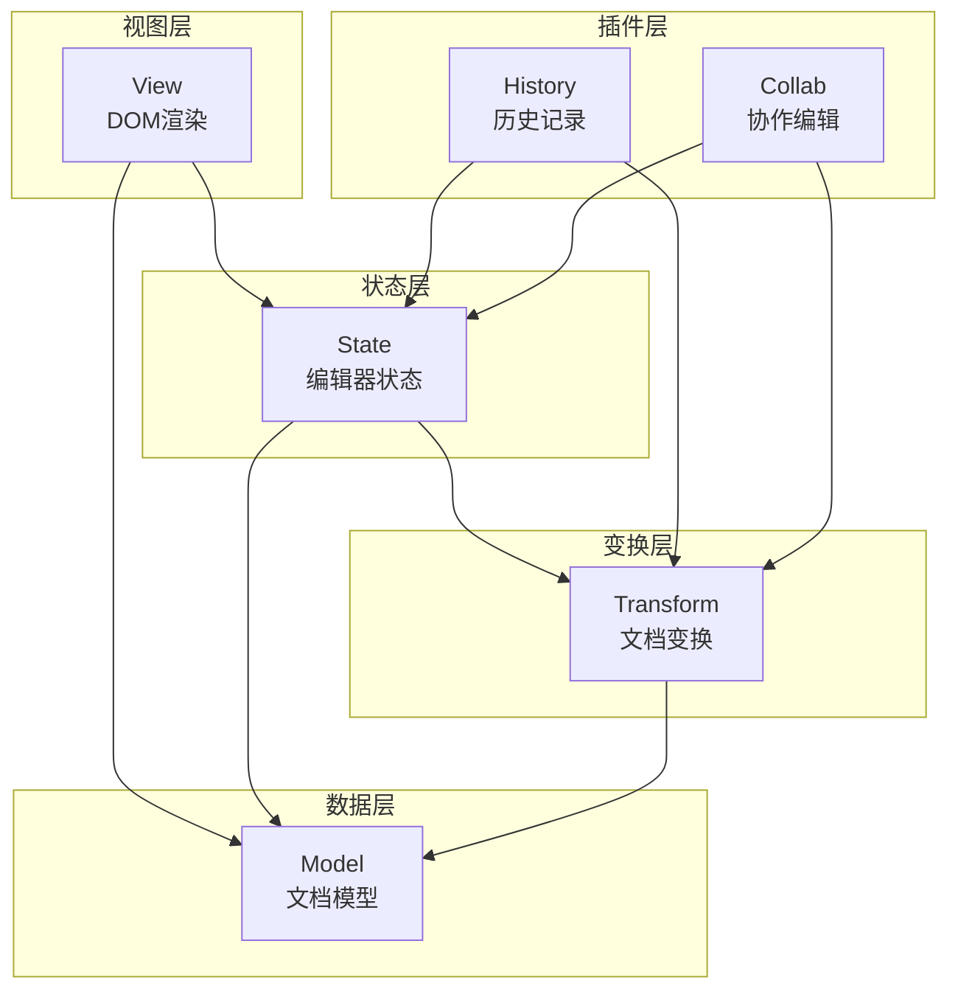
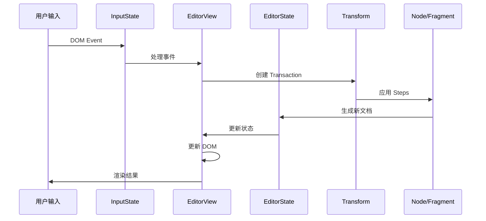

## 整体架构设计

ProseMirror 采用分层模块化设计，核心依赖关系如下：



## 核心数据结构实现

### 1. Node - 不可变文档树

从 test-node.ts 可以看出 Node 的核心特性：

```typescript
// Node 的不可变操作
describe('cut', () => {
  function cut(doc: Node, cut: Node) {
    return ist(doc.cut(doc.tag.a, doc.tag.b), cut, eq)
  }

  it('extracts a full block', () =>
    cut(doc(p('foo'), '<a>', p('bar'), '<b>', p('baz')), doc(p('bar'))))

  it('cuts text', () => cut(doc(p('0'), p('foo<a>bar<b>baz'), p('2')), doc(p('bar'))))
})
```

Node 的实现关键：

- **不可变性**: 所有操作返回新实例
- **树形结构**: 通过 Fragment 管理子节点
- **位置映射**: 支持精确的位置计算

### 2. Schema - 文档结构约束

从测试可以看出 Schema 的内容匹配机制：

```typescript
// prosemirror-model/test/test-content.ts
it('matches one element to an asterisk', () => valid('image*', 'image'))
it('matches multiple elements to an asterisk', () => valid('image*', 'image image image image'))
it('matches group members to a group', () => valid('inline*', 'image text'))
it('matches a simple sequence', () =>
  valid('paragraph horizontal_rule paragraph', 'paragraph horizontal_rule paragraph'))
```

### 3. Transform - 操作变换系统

从 test-trans.ts 可以看出变换的核心机制：

```typescript
describe('delete', () => {
  function del(doc: Node, expect: Node) {
    return ist(new Transform(doc).delete(doc.tag.a, doc.tag.b).doc, expect, eq)
  }

  it('can delete a word', () => del(doc(p('foo<a>bar<b>baz')), doc(p('foobaz'))))

  it('can delete across blocks', () => del(doc(p('a<a>'), p('<b>b')), doc(p('ab'))))
})
```

## DOM 交互核心机制

### 1. 输入处理系统

从 input.ts 可以看到事件处理架构：

```typescript
// 事件处理器映射
const handlers: { [event: string]: (view: EditorView, event: Event) => void } = {}
const editHandlers: { [event: string]: (view: EditorView, event: Event) => void } = {}

// 输入状态管理
export class InputState {
  shiftKey = false
  mouseDown: MouseDown | null = null
  lastKeyCode = 0
  lastKeyCodeTime = 0
  lastClick = { time: 0, x: 0, y: 0, type: '' }
  lastSelectionOrigin: string | null = null
  lastSelectionTime = 0
  lastIOSEnter = 0
  lastIOSEnterFallbackTimeout: any = null
  lastFocusTime = 0
  lastAndroidDelete = 0
  composing = false
  composingTimeout: any = null
  compositionNodes: { node: Text; pos: number; start: number; end: number }[] = []
  compositionEndedAt = -2e8
  domChangeCount = 0
  eventHandlers: { [event: string]: (event: Event) => void } = {}
}
```

### 2. DOM 变更检测

从 webtest-domchange.ts 可以看出 DOM 变更处理策略：

```typescript
it('notices when text is added', () => {
  let view = tempEditor({ doc: doc(p('hello')) })
  findTextNode(view.dom, 'hello')!.nodeValue = 'heLllo'
  flush(view)
  ist(view.state.doc, doc(p('heLllo')), eq)
})

it('handles splitting of a textblock', () => {
  let view = tempEditor({ doc: doc(h1('abc'), p('defg<a>')) })
  let para = view.dom.querySelector('p')!
  let split = para.parentNode!.appendChild(para.cloneNode()) as HTMLElement
  split.innerHTML = 'fg'
  findTextNode(para, 'defg')!.nodeValue = 'dexy'
  setSel(split.firstChild!, 1)
  flush(view)
  ist(view.state.doc, doc(h1('abc'), p('dexy'), p('fg')), eq)
})
```

### 3. 选择处理机制

从 webtest-selection.ts 可以看出选择同步的复杂性：

```typescript
it('syncs the selection', () => {
  let view = tempEditor({ doc: doc(p('foo')) })
  setSel(view, 2)
  let sel = getSelection()!
  ist(sel.focusNode, findTextNode(view.dom, 'foo'))
  ist(sel.focusOffset, 1)
})

it('makes arrow motion go through selectable inline nodes', () => {
  let view = tempEditor({ doc: doc(p('foo<a>', img, 'bar')) })
  view.dispatchEvent(event(RIGHT))
  ist(view.state.selection.from, 4)
  view.dispatchEvent(event(RIGHT))
  ist(view.state.selection.head, 5)
})
```

## 装饰系统实现

### 1. Decoration 类型系统

从 webtest-draw-decoration.ts 可以看出装饰的绘制逻辑：

```typescript
it('draws inline decorations', () => {
  let view = tempEditor({ doc: doc(p('foobar')), plugins: [decoPlugin(['2-5-foo'])] })
  ist(view.dom.querySelector('.foo')!.textContent, 'oob')
})

it('draws overlapping inline decorations', () => {
  let view = tempEditor({
    doc: doc(p('abcdef')),
    plugins: [decoPlugin(['3-5-foo', '4-6-bar', '1-7-baz'])]
  })
  let baz = view.dom.querySelectorAll('.baz') as any as HTMLElement[]
  ist(baz.length, 5)
  ist(Array.prototype.map.call(baz, x => x.textContent).join('-'), 'ab-c-d-e-f')
})
```

### 2. Widget 实现

```typescript
it('draws multiple widgets', () => {
  let view = tempEditor({
    doc: doc(p('foobar')),
    plugins: [decoPlugin(['1-widget', '4-widget', '7-widget'])]
  })
  let found = view.dom.querySelectorAll('button') as any as HTMLElement[]
  ist(found.length, 3)
  ist(found[0].nextSibling!.textContent, 'foo')
  ist(found[1].nextSibling!.textContent, 'bar')
  ist(found[2].previousSibling!.textContent, 'bar')
})
```

## 插件系统架构

### 1. History 插件实现

从 test-collab.ts 可以看出历史管理：

```typescript
it('supports undo', () => {
  let s = new DummyServer()
  s.type(0, 'A')
  s.type(1, 'B')
  s.type(0, 'C')
  s.undo(1)
  s.conv('AC')
  s.type(1, 'D')
  s.type(0, 'E')
  s.conv('ACDE')
})
```

### 2. 协作编辑实现

协作编辑的操作变换算法：

```typescript
it('converges for simple changes', () => {
  let s = new DummyServer()
  s.type(0, 'hi')
  s.type(1, 'ok', 3)
  s.type(0, '!', 5)
  s.type(1, '...', 1)
  s.conv('...hiok!')
})

it('converges with three peers', () => {
  let s = new DummyServer(undefined, 3)
  s.type(0, 'A')
  s.type(1, 'U')
  s.type(2, 'X')
  s.type(0, 'B')
  s.type(1, 'V')
  s.type(2, 'C')
  s.conv('AUXBVC')
})
```

## DOM 解析与序列化

### 1. 剪贴板处理

从 webtest-clipboard.ts 可以看出解析逻辑：

```typescript
it('can read external HTML', () => {
  let view = tempEditor(),
    $p = view.state.doc.resolve(1)
  ist(
    parseFromClipboard(view, '', '<p>hello</p><hr>', false, $p),
    new Slice(doc(p('hello'), hr()).content, 1, 0),
    eq
  )
})

it('will sanely clean up top-level nodes in HTML', () => {
  let view = tempEditor(),
    $p = view.state.doc.resolve(1)
  ist(
    parseFromClipboard(view, '', '<ul><li>foo</li></ul>bar<br>baz', false, $p),
    new Slice(doc(ul(li(p('foo'))), p('bar', br(), 'baz')).content, 3, 1),
    eq
  )
})
```

### 2. DOM 序列化

从 test-dom.ts 可以看出序列化机制：

```typescript
it('can represent simple node', test(doc(p('hello')), '<p>hello</p>'))

it(
  'joins styles',
  test(
    doc(p('one', strong('two', em('three')), em('four'), 'five')),
    '<p>one<strong>two</strong><em><strong>three</strong>four</em>five</p>'
  )
)
```

## NodeView 扩展机制

从 webtest-nodeview.ts 可以看出自定义节点渲染：

```typescript
it("can replace a node's representation", () => {
  let view = tempEditor({
    doc: doc(p('foo', br())),
    nodeViews: {
      hard_break() {
        return { dom: document.createElement('var') }
      }
    }
  })
  ist(view.dom.querySelector('var'))
})

it('can provide a contentDOM property', () => {
  let view = tempEditor({
    doc: doc(p('foo')),
    nodeViews: {
      paragraph() {
        let dom = document.createElement('p')
        return { dom, contentDOM: dom }
      }
    }
  })
  let para = view.dom.querySelector('p')!
  view.dispatch(view.state.tr.insertText('a'))
  ist(view.dom.querySelector('p'), para)
})
```

## 核心数据流



## 性能优化策略

### 1. 增量更新

从测试中可以看出 ProseMirror 的增量更新策略：

```typescript
it("doesn't redraw content with marks when typing in front", () => {
  let view = tempEditor({ doc: doc(p('foo', em('bar'), strong('baz'))) })
  let bar = findTextNode(view.dom, 'bar')!,
    foo = findTextNode(view.dom, 'foo')!
  foo.nodeValue = 'froo'
  flush(view)
  ist(view.state.doc, doc(p('froo', em('bar'), strong('baz'))), eq)
  ist(bar.parentNode && view.dom.contains(bar.parentNode))
  ist(foo.parentNode && view.dom.contains(foo.parentNode))
})
```

### 2. DOM 复用

```typescript
it("doesn't redraw following paragraphs when a paragraph is split", () => {
  let view = tempEditor({ doc: doc(p('abcde'), p('fg')) })
  let lastPara = view.dom.lastChild
  view.dispatch(view.state.tr.split(3))
  ist(view.dom.lastChild, lastPara)
})
```

## 关键实现细节

### 1. 位置映射系统

从 test-mapping.ts 可以看出位置映射的精确性：

```typescript
it('can map through a single insertion', () => {
  testMapping(mk([2, 0, 4]), [0, 0], [2, 6], [2, 2, -1], [3, 7])
})

it('can map through a single deletion', () => {
  testMapping(mk([2, 4, 0]), [0, 0], [2, 2], [6, 2], [8, 4])
})
```

### 2. 内容匹配算法

```typescript
it('accepts a sequence asterisk matching zero elements', () =>
  valid('heading paragraph*', 'heading'))
it('accepts a sequence asterisk matching multiple elts', () =>
  valid('heading paragraph*', 'heading paragraph paragraph'))
it('accepts a sequence plus matching one element', () =>
  valid('heading paragraph+', 'heading paragraph'))
it('fails when a sequence plus has no elements', () => invalid('heading paragraph+', 'heading'))
```

### 3. 标记系统

从 test-mark.ts 可以看出标记的优先级处理：

```typescript
it('adds marks with higher rank after others', () =>
  ist(strong.addToSet([em_]), [em_, strong], Mark.sameSet))

it('puts code marks at the end', () =>
  ist(
    code.addToSet([em_, strong, link('http://foo')]),
    [em_, strong, link('http://foo'), code],
    Mark.sameSet
  ))
```

ProseMirror 的架构设计体现了以下核心理念：

1. **数据不可变**: 保证状态一致性和可预测性
2. **分层设计**: 每层职责清晰，降低耦合
3. **增量更新**: 最小化 DOM 操作，提升性能
4. **扩展性**: 插件系统支持复杂功能扩展
5. **精确控制**: 位置映射和变换系统保证操作精确性

这种设计使得 ProseMirror 既能处理复杂的富文本编辑需求，又能保持良好的性能和可维护性。

找到具有 2 个许可证类型的类似代码
